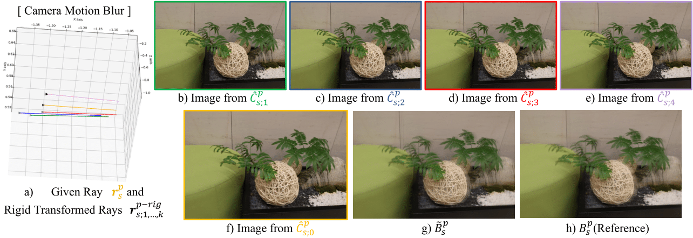
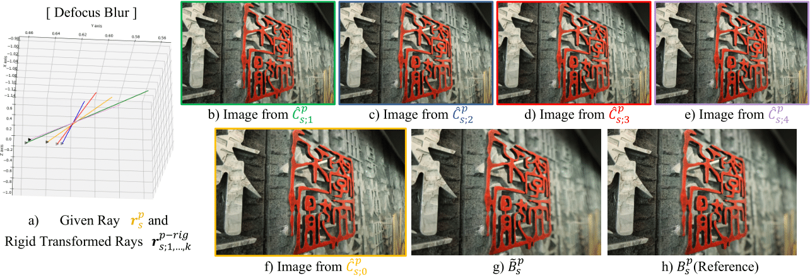

## Official implementation of DP-NeRF.

# DP-NeRF: Deblurred Neural Radiance Field with Physical Scene Priors (CVPR 2023)

We propose DP-NeRF, a novel neural radiance field (NeRF) framework, that reconstructs the clean 3D scene from blurry images applying rigid blurring kernel (RBK) based on physical scene priors.
We impose the physical constraints on the blurring kernel of neural radiance field inspired by the in-camera blurring process during image acquisition on the 3D scene.

- [[Project Page]](https://dogyoonlee.github.io/dpnerf/)
  
- [[CVPR paper link]](https://openaccess.thecvf.com/content/CVPR2023/papers/Lee_DP-NeRF_Deblurred_Neural_Radiance_Field_With_Physical_Scene_Priors_CVPR_2023_paper.pdf)

- [[CVPR suppelementary paper link]](https://openaccess.thecvf.com/content/CVPR2023/supplemental/Lee_DP-NeRF_Deblurred_Neural_CVPR_2023_supplemental.pdf)

- [[arXiv paper link]](https://arxiv.org/pdf/2211.12046.pdf)


# Overview

`DP-NeRF` models the rigid blurring kernel (RBK) which preserve the 3D geomentric and appearance consistency to reconstruct the clean neural radiance field (NeRF) from blurry inputs. RBK is formulated as rigid motions of the cameras which are shared with all pixels in a single image. It effectively model the blind blurring kernel on each images by imposing physical constraints of the acquired blurred image imitating blurring process.




# Training & Evaluation

## 1. Environment
```
git clone https://github.com/dogyoonlee/DP-NeRF.git
cd DP-NeRF
pip install -r requirements.txt
```
<details>
  <summary> Dependencies (click to expand) </summary>
  <li>numpy
  <li>scikit-image
  <li>torch>=1.8
  <li>torchvision>=0.9.1
  <li>imageio
  <li>imageio-ffmpeg
  <li>matplotlib
  <li>configargparse
  <li>tensorboardX>=2.0
  <li>opencv-python
  <li>einops
  <li>tensorboard
</details>


## 2. Download dataset
We use the dataset from [Deblur-NeRF](https://github.com/limacv/Deblur-NeRF) to train the DP-NERF. Download the dataset from [here](https://hkustconnect-my.sharepoint.com/personal/lmaag_connect_ust_hk/_layouts/15/onedrive.aspx?id=%2Fpersonal%2Flmaag%5Fconnect%5Fust%5Fhk%2FDocuments%2Fshare%2FCVPR2022%2Fdeblurnerf%5Fdataset&ga=1). 

There are total of 31 scenes used in the paper, 5 synthetic scene and 10 real-world scene for each blur type: camera-motion blur, defocus blur. In addition, there are 1 scene for object motion blur which are refered as temporal inconsistency in our paper.

Note that, quantitative evaluation of the `bush` scene in real-defocus dataset is excluded in the paper since there are no clean ground truth image to evaluate.


## 3. Set parameters
Change the training parameters to train on your computer.
You must change the `basedir`, `datadir`, and `tbdir`.

<details>
  <summary> Training Options (click to expand) </summary>
  <ul>
  <li>expname: name of the experiment.
  <li>rbk_use_origin: use origin ray to train the RBK. Default to use.
  <li>rbk_num_motion: the number of rigid motion. k in the paper.
  <li>use_dpnerf: use rigid blurring kernel.
  <li>use_awp: use adaptive weight proposal.
  <li>use_coarse_to_fine_opt: use coarse-to-fine optimization.
  </ul>
</details>

## 4. Train
For example, to train `blurpool` scene, 
```
python run_dpnerf.py --config ./configs/blurpool/tx_blurpool_dpnerf.txt --expname $experiment_name
```
The training and tensorboard results will be save in `<basedir>/<expname>` and `<tbdir>`.

## 5. Evaluation

Evaluation is automatically executed every `--i_testset` iterations.
Please refer the other logging options in `run_dpnerf.py` to adjust save and print the results.

After the training, execute the evaluation results following command.
For example, to evaluate `blurpool` scene after 200000 iteration,
```
python run_dpnerf.py --config ./configs/blurpool/tx_blurpool_dpnerf.txt --expname $dir_to_log --ft_path ./<basedir>/<expname>/200000.tar --render_only --render_test
```


# Pretrained Weights
We additionally provide the pretrained weight sample for `blurpool` scene in [here](https://github.com/dogyoonlee/DP-NeRF/tree/main/pretrained/blurpool).

We cannot provide the pretrained weights for full scene since we did refactoring on the code after submit our work on the conference.

Hence, we trained our model again for `blurpool` scene.

The evaluation result of the provided sample weight is as follows:

<table class="tg">

<tbody>
  <tr>
    <td class="tg-0pky"></td>
    <td class="tg-c3ow" colspan=""><span style="font-weight:400;font-style:normal">PNSR</span></td>
    <td class="tg-c3ow" colspan=""><span style="font-weight:400;font-style:normal">SSIM</span></td>
    <td class="tg-c3ow" colspan=""><span style="font-weight:400;font-style:normal">LPIPS</span></td>
  </tr>
  <tr>
    <td class="tg-0pky">Blurpool(paper)</td>
    <td class="tg-c3ow"><span style="font-weight:400;font-style:normal">31.96</span></td>
    <td class="tg-c3ow"><span style="font-weight:400;font-style:normal">0.8768</span></td>
    <td class="tg-c3ow"><span style="font-weight:400;font-style:normal">0.0908</span></td>
  </tr>
  <tr>
    <td class="tg-0pky">Blurpool(provided weight)</td>
    <td class="tg-c3ow"><span style="font-weight:400;font-style:normal">32.04</span></td>
    <td class="tg-c3ow"><span style="font-weight:400;font-style:normal">0.8754</span></td>
    <td class="tg-c3ow"><span style="font-weight:400;font-style:normal">0.0873</span></td>
  </tr>
</tbody>
</table>


# Visualization
You can render or save the results after 200000 iteration of training following process.

## 1. Visualization of trained model

### Visualize the trained model as videos of spiral-path.
Results will be saved in `./<basedir>/<dir_to_log>/renderonly_path_199999`.

```
python run_dpnerf.py --config ./configs/blurpool/tx_blurpool_dpnerf.txt --expname $dir_to_log --ft_path ./<basedir>/<expname>/200000.tar --render_only 
```

### Visualize the trained model as images of training views in datasets.
Results will be saved in `./<basedir>/<dir_to_log>/renderonly_test_199999`

```
python run_dpnerf.py --config ./configs/blurpool/tx_blurpool_dpnerf.txt --expname $dir_to_log --ft_path ./<basedir>/<expname>/200000.tar --render_only  --render_test
```

## 2. Save the warped poses and images

Results will be saved in `./<basedir>/<dir_to_log>/warped_ray_img_path_199999`

```
python run_dpnerf.py --config ./configs/blurpool/tx_blurpool_dpnerf.txt --expname $dir_to_log --ft_path ./<basedir>/<expname>/200000.tar --save_warped_ray_img
```

## 3. Visualize the warped rays

You can visualize the warped rays in specific image index using following command.

Note that, you should modify the code of plotting rays in [here](https://github.com/dogyoonlee/DP-NeRF/blob/main/warped_rays_vis.py#L347) of `warped_rays_vis.py` correponding to your trained model (`rbk_num_motion`) in saved checkpoint.

```
python warped_rays_vis.py --config ./configs/blurpool/tx_blurpool_dpnerf.txt --warped_rays_path $warped_ray_saved_dir/rays_warped.npy
```

# Notes

## GPU memory 

DP-NeRF require gradually large memory as the number of rigid motion increases. 
It is same drawback with [Deblur-NeRF](https://github.com/limacv/Deblur-NeRF).
If you have not enough memory to train on your single GPU, set `N_rand` to a smaller value, or use multiple GPUs.

## Multi-GPUs training

To train the DP-NeRF with multiple gpus, please set `num_gpu=<num_gpu>`.

## Original NeRF training

To train original NeRf, set `blur_model_type = none`.


# License

MIT License

# Citation

If you find our work useful in your research, please consider citing:

```
@InProceedings{Lee_2023_CVPR,
    author    = {Lee, Dogyoon and Lee, Minhyeok and Shin, Chajin and Lee, Sangyoun},
    title     = {DP-NeRF: Deblurred Neural Radiance Field With Physical Scene Priors},
    booktitle = {Proceedings of the IEEE/CVF Conference on Computer Vision and Pattern Recognition (CVPR)},
    month     = {June},
    year      = {2023},
    pages     = {12386-12396}
}

@article{lee2022deblurred,
  title={Deblurred Neural Radiance Field with Physical Scene Priors},
  author={Lee, Dogyoon and Lee, Minhyeok and Shin, Chajin and Lee, Sangyoun},
  journal={arXiv preprint arXiv:2211.12046},
  year={2022}
}
```

## Acknowledgement

The structure of this codebase is borrowed from
[Deblur-NeRF](https://github.com/limacv/Deblur-NeRF).

